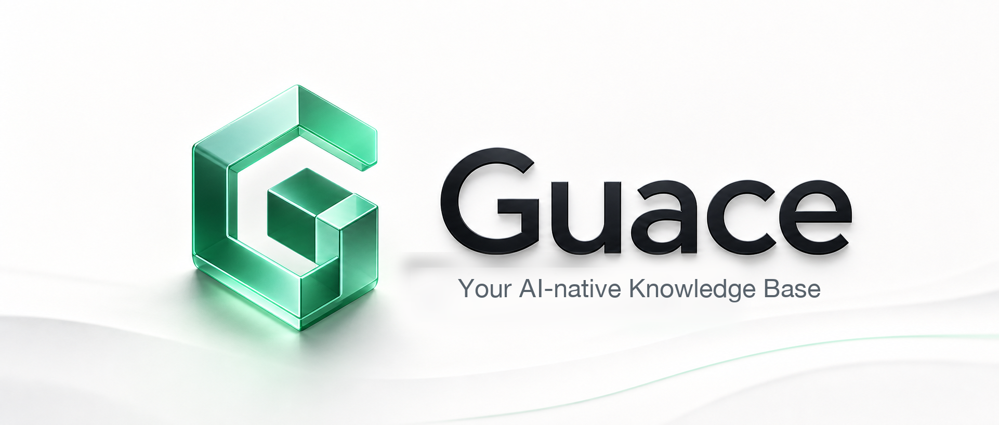
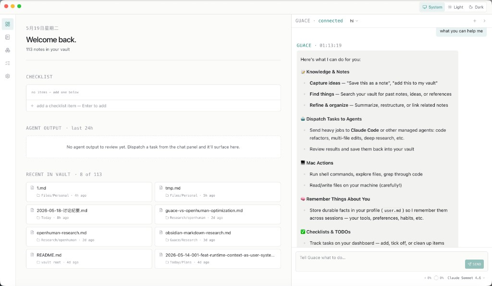

<p align="center">
  
</p>

<h3 align="center">An intelligent personal knowledge base with powerful managed agents.</h3>

<p align="center"><em>For macOS · local-first · your keys, your files, your machine.</em></p>

<p align="center">
  
</p>

This repository hosts public, downloadable builds. The source itself lives in a private repository.

---

## What is Guace?

Two things, married into one app:

- **A conversational knowledge base** — every note, conversation, fact, and decision lives in *your* markdown vault on *your* disk, and you talk to it in plain language. Ask it to find that thing you wrote three weeks ago, summarise everything you've captured about a project, restructure a messy note, or just *"save this as a fact about me"* — Guace reads the vault as long-term memory and writes back as you think. Obsidian-compatible (plain `.md` under `~/Documents/Guace/vault/`).
- **Managed agents** — when a job needs a real worker (multi-file refactor, deep research, long-horizon task), Guace dispatches it to **Claude Code** or **OpenAI Codex CLI** running in its own isolated workspace, watches the result, and brings the artifact back so you can fold it into the vault.

The "intelligent" in *intelligent personal knowledge base* isn't only the agents — it's that your notes are a thing you can **chat with**, not a folder you have to grep.

The loop the product is optimised for:

> **capture → refine → dispatch when needed → review the artifact → save back to the vault → recall later.**

Unlike a cloud chatbot, nothing about your knowledge leaves your machine. Notes stay on disk, API keys live in macOS Keychain, LLM requests go straight from your computer to the provider you chose. No telemetry, no analytics.

## Why you might want it

- You already keep markdown notes (Obsidian, plain folders, an existing vault) and want an agent that can actually edit them.
- You use Claude Code / Codex daily and want a chat-style "manager" that decides when to delegate to them.
- You don't want a SaaS — you want the data, the prompts, and the keys to stay on your laptop.
- You've felt the pain of context windows and want a tool that's honest about cache hits, token cost, and what it's actually doing.

## Highlights

- **Chat with your vault** — natural-language search, summarisation, and refactoring across your markdown notes. *"What did I decide about X?"*, *"Pull every TODO I wrote this week into one note"*, *"Remember that I prefer pnpm over npm"* — all just work, on top of plain files you still own.
- **Vault editor** — live markdown preview with wikilinks (`[[Page]]`), embeds (`![[Page]]`), headings outline, hashtag indexing, frontmatter, image / PDF / HTML preview.
- **Daemon-backed architecture** — long-running tasks survive Electron restarts; the UI is just a client.
- **Approval prompts** on destructive shell ops (`rm`, `git reset --hard`, `sudo`, force-push…). Approve once, "always this session", or deny.
- **Usage dashboard** — per-model token / cost breakdown, cache hit rate, daily volume chart. Powered by real provider usage data, not estimates.
- **Checklist tool** — dashboard checklist the agent can also read / mutate via a tool call, so "remind me to X" actually persists.
- **Managed agent orchestration** — dispatch tasks to Claude Code / Codex; follow up, cancel, or save results to the vault.
- **Multi-provider** — Vercel AI Gateway (Anthropic / OpenAI / DeepSeek / Google through one key) or DeepSeek's API directly. More backends planned.
- **No telemetry, no analytics.**

## Status

Pre-1.0. Schemas are still moving, the .dmg isn't notarised, and you're trusting an unverified app to run a shell tool on your machine. Don't dispatch anything you wouldn't run by hand.

---

## Latest builds

| Platform | Download | Notes |
| --- | --- | --- |
| **macOS (Apple Silicon)** | [`Guace-0.0.2-arm64.dmg`](../../releases/latest) | Requires macOS 10.12+ |
| **macOS (Apple Silicon, zip)** | [`Guace-0.0.2-arm64-mac.zip`](../../releases/latest) | Same payload, no installer |

Intel (`x64`) builds are not produced yet — open an issue if you need one.

## Install

1. Download the `.dmg` from the [latest release](../../releases/latest).
2. Open the `.dmg`, drag **Guace** to **Applications**.
3. Launch from Launchpad / Spotlight.

### "App is from an unidentified developer"

Guace isn't (yet) signed with an Apple Developer ID, so macOS Gatekeeper will block the first launch. Two ways around it:

**Right-click route (recommended):**
1. In **Applications**, right-click **Guace** → **Open**.
2. Click **Open** in the dialog. macOS remembers your choice forever.

**Terminal route (if Gatekeeper won't budge):**
```bash
xattr -dr com.apple.quarantine /Applications/Guace.app
```

Then double-click as normal.

## First-run setup

Guace is a chat front-end + orchestrator on top of *your* keys and *your* tools. After launch:

1. **Add an LLM provider key** — Vercel AI Gateway, DeepSeek, etc. Settings → *Models & Providers*. Keys stay in macOS Keychain only.
2. **(Optional) Register a managed agent** — install [Claude Code](https://docs.anthropic.com/en/docs/agents-and-tools/claude-code) or [OpenAI Codex CLI](https://github.com/openai/codex) so it's on your PATH, then add it under *Agents*. Guace will dispatch heavy tasks to it.

That's it — you can start a session and type. Try `"create a note at projects/2026-roadmap.md with these bullets: …"` to see the agent touch the vault.

## Where data lives

| What | Path |
| --- | --- |
| Sessions, tasks, settings (SQLite) | `~/Library/Application Support/Guace/guace.db` |
| Prompts (`agent.md`, `user.md`) | `~/Library/Application Support/Guace/prompts/` |
| Your vault (markdown notes) | `~/Documents/Guace/vault/` |
| Task workspaces | `~/Documents/Guace/workspaces/` |
| Provider API keys | macOS Keychain — service `ai.guace.daemon` |

Uninstall = drag Guace from Applications + delete those directories. (Keychain entries are reusable across reinstalls; remove them via Keychain Access if you want a clean slate.)

## Reporting bugs

Open an issue here with:
- The Guace version (shown in *Settings*)
- What you did
- What you expected vs. what happened
- Screenshots / log snippets where useful

For private / security-sensitive reports, email the maintainer directly.

## License

Binary releases are distributed under the terms shown in the private source repository. Reverse engineering / repackaging without permission isn't welcome; using the app on your own machine is.
